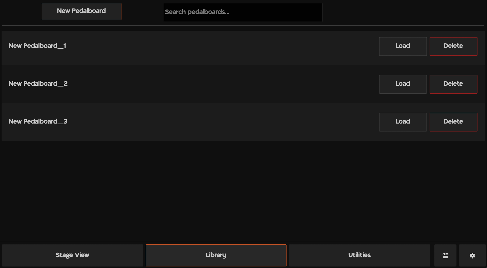
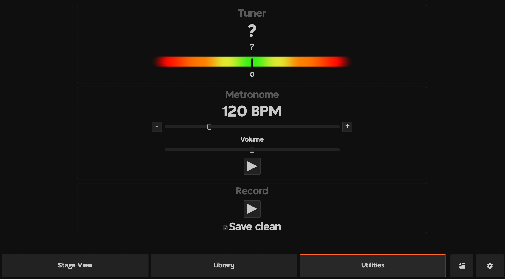

# **rs-pedalboard** - Virtual Guitar Pedalboard
## About

**rs-pedalboard** is a guitar effects processor for Windows and Linux. Build virtual pedalboards using the in-built effects, VST2/3 plugins and [Neural Amp Modeler](https://www.neuralampmodeler.com/) integration.


## Features
- Pedalboard stage allows seamless switching between tones
- Library to store and organise pedalboards
- Built-in pedals including:
    - Drive (Overdrive/Distortion/Fuzz)
    - Modulation (Chorus/Flanger/Phaser)
    - EQ
    - Delay/Reverb
    - Pitch Shift
    - Noise Gate
    - Amp/Cab Simulation (Neural Amp Modeler/Impulse Response)
    - VST2/VST3 - *experimental*
- Utilities
    - Chromatic Tuner
    - Metronome
    - Record to file
- Supported audio APIs
    - Windows - WASAPI/ASIO
    - Linux - JACK
- MIDI Control and Function Mapping
    - Use MIDI CC messages to control parameters and a range of other functions
    - Allows integration with physical pedalboard buttons
- Touchscreen support

## How to Use
The project consists of 2 binaries, `pedalboard-processor` and `pedalboard-client`. The processor handles audio devices, effects processing and more. The client contains the UI, which is used to interact with the processor.

### Building the binaries
#### Requirements

- `cargo` - Rust compiler
- `clang` - setup per instructions in [bindgen](https://rust-lang.github.io/rust-bindgen/requirements.html)
- On Linux:
    - JACK (`jackd`, `jack_connect`, `jack_wait`)
    - ALSA dev libraries


In the project's root directory, execute the commands:

```bash
cargo build --release --bin pedalboard-processor --features="processor"
cargo build --release --bin pedalboard-client --features="client" 
```

### Executing the project

1) Start the processor binary. Command line options can be viewed in the help message. On Windows, this looks like:

    ```bash
    pedalboard-processor --help

    Usage: pedalboard-processor.exe [OPTIONS]

    Options:
    -h, --host <HOST>
            Audio host to use (WASAPI (default) or ASIO)
    -f, --frames-per-period <FRAMES_PER_PERIOD>
            Number of frames (samples) processed at a time
    -b, --buffer-latency <BUFFER_LATENCY>
            Latency in milliseconds for the internal buffer
        --periods-per-buffer <PERIODS_PER_BUFFER>
            Number of periods per buffer (JACK only) (default: 3)
        --tuner-min-freq <TUNER_MIN_FREQ>
            Minimum frequency for the tuner (default: 40)
        --tuner-max-freq <TUNER_MAX_FREQ>
            Maximum frequency for the tuner (default: 1300)
        --tuner-periods <TUNER_PERIODS>
            Number of periods of the minimum frequency to process for pitch (default: 5)
    -i, --input-device <INPUT_DEVICE>
            
    -o, --output-device <OUTPUT_DEVICE>
            
        --preferred-sample-rate <PREFERRED_SAMPLE_RATE>
            Preferred sample rate for the audio host. Uses highest if not available. (default: 48000)
        --upsample-passes <UPSAMPLE_PASSES>
            Number of 2x upsample passes to apply before processing (default: 0)
        --ignore-save
            Ignore saved settings - use command line arguments/default
        --recording-dir <RECORDING_DIR>
            Directory to save recordings to (default: ~/rs_pedalboard/Recordings)
    -h, --help
            Print help
    ```

    Processor settings are also loaded from the `processor_settings.json` (see [Persistence](#persistence)). Where both arguments and saved settings exist for a setting, the argument takes precedence.

    The client is able to start the processor binary by pressing *Start Processor* in Settings, which executes the binary in the environment variable `RSPEDALBOARD_PROCESSOR`, or attempts to execute a `pedalboard-processor` in `PATH` or current working directory.

2) Start the client binary `pedalboard-client`. The client attempts to connect to the processor via TCP on port 29475, either on startup and when the *Connect* button is pressed in settings. The client has a single command line argument `--no-processor`, which skips connecting to the processor on startup.

## Features Flags
- `processor` - required for the processor binary.
- `client` - required for the client binary.
- `asio` (enabled by default) - enables the ASIO audio API on Windows. Use on both client and processor.
- `log_full_commands` - output the full commands sent/received between client and processor in the log files. Defaults to first 40 characters otherwise.
- Client only:
    - `glow` - Use the glow renderer in egui (defaults to wgpu).
    - `windowed` - Start the client in a window (defaults to fullscreen borderless).
    - `virtual_keyboard` - Use an on-screen keyboard to type on touchscreen devices.

## Logs
Logs are saved to `pedalboard-client.log` and `pedalboard-processor.log` in the current working directory. 

## Persistence and NAM/IR/VST files
Persistence is handled by the client binary. Files (settings, pedalboards, recordings) are saved in the directory `~/rs_pedalboard`.

Neural Amp Modeler files are searched for in `~/rs_pedalboard/NAM`.

Impulse Response files are searched for in `~/rs_pedalboard/IR`.

VST2 plugins are searched for in:
- Windows - `C:\Program Files\Steinberg\VSTPlugins`
- Linux - `/usr/lib/vst`

VST3 plugins are searched for in:
- Windows - `C:\Program Files\Common Files\VST3`
- Linux - `/usr/lib/vst3`

Other directories for NAM/IR/VST can be added in client settings.


## Using the library
The core of the project is the `rs_pedalboard` library. This contains the core code which is shared between both binaries and can be integrated with other projects. There is not yet documentation for the library, but the key places to start are:

- `Pedalboard` - contains an ordered set of pedals 
- `PedalboardSet` - contains an ordered set of pedalboards which can be switched between
- `processor_api::process_audio_file_and_save` - process an audio file with a given Pedalboard and save the output to a file (WAV)

## Troubleshooting
- Processor executable not found - set the `RSPEDALBOARD_PROCESSOR` environment variable to the processor binary, add the binary to path or move the binary to the working directory
- XRuns - increase buffer size/latency
- Clipping - reduce the volume of the pedalboard
- Read [logs](#logs)

## Screenshots


